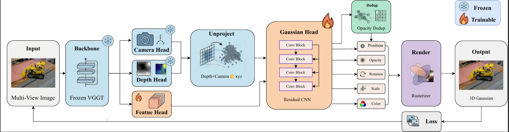

<div align="center">

# VGGT-Gaussian: Feed-Forward 3D Gaussian Reconstruction


</div>

<p align="center">
  
</p>

---

## 📖 Introduction

**VGGT-Gaussian** builds on top of [VGGT](https://github.com/facebookresearch/vggt) (Visual Geometry Grounded Transformer) and extends it with a feed-forward 3D Gaussian Splatting head, enabling direct regression of pixel-aligned 3D Gaussians from a set of input images **without per-scene optimization**. Given one or more RGB images, the model jointly predicts camera parameters, depth/point maps, and Gaussian primitive attributes (position, scale, rotation, opacity, color) in a single forward pass, which can then be rendered via differentiable Gaussian rasterization for novel view synthesis.

Key features:

- 🚀 **Feed-forward reconstruction** — no per-scene optimization required.
- 📷 **Sparse / unposed views supported** — leverages VGGT's pose-free geometric backbone.
- 🎯 **3D Gaussian Splatting output** — directly renderable, high-quality, real-time novel view synthesis.

## 🔧 Installation

### Option A: pip (local environment)

We recommend Python 3.10 and CUDA 12.1

```bash
git clone https://github.com/gwj212/VGGT-G.git
cd VGGT-G

conda create -n vggt-gaussian python=3.10 -y
conda activate vggt-gaussian

pip install -r requirements.txt
```

## Pretrained Checkpoint

The official pretrained checkpoint is available on the Hugging Face Hub:

**https://huggingface.co/wenjiaGUO/VGGT-G**

Download `ckpt.pth` and place it in the project root, or specify its location via the `CKPT_PATH` environment variable.

The checkpoint contains the trained weights for the `gaussian_head` and `dpt_feature_head` modules (~440 MB). The VGGT-1B backbone is automatically downloaded from the Hugging Face Hub on the first run.

<!-- TODO: add the ckpt.pth download link -->

---

## ⚡ Quickstart / Demo

###  Run the interactive web demo

```bash
CKPT_PATH=ckpt.pth PORT=7860 python app.py
```

Then open `http://localhost:7860` in your browser. Sample images are provided under `demo_assets/`. Useful environment variables: `PORT` (default 7860), `CKPT_PATH`, `SHARE` (set 1 for a temporary public link), `DEMO_MOCK` (set 1 to force mock mode).


> Requires the NVIDIA driver, Docker, and `nvidia-container-toolkit` (so `--gpus all` works). See `ENVIRONMENT.md` for details.

## 🏋️ Training

Training is launched via `train_nogt.py`. The `nogt` suffix indicates the **no-ground-truth** training setting: the Gaussian head is trained without any ground-truth Gaussians, supervised only by a geometry-based initialization anchor, a differentiable render loss, and an opacity de-duplication term.

Paths and options are passed via environment variables (each subfolder of `TRAIN_DIR` / `TEST_DIR` is one scene of multi-view images):

```bash
# single GPU
CUDA_VISIBLE_DEVICES=0 \
TRAIN_DIR=/path/to/dataset/train \
TEST_DIR=/path/to/dataset/test \
OUTPUT_DIR=./runs/vggt_gaussian_exp1 \
python train_nogt.py --single


Checkpoints, a text log, and periodic render previews are written to `OUTPUT_DIR`. At startup the script also writes a lightweight test cache (`OUTPUT_DIR/test_cache/*.pt`) that the reconstruction evaluation below consumes.

---

## 📊 Evaluation

There are two complementary scripts. `eval.py` measures **reconstruction** quality (how faithfully the model re-renders the same views it was given, on the cached test scenes from training), while `eval_nvs.py` measures **novel-view synthesis** (rendering held-out views at ground-truth poses).

### Reconstruction / geometry evaluation

```bash
CKPT_PATH=ckpt.pth \
TEST_CACHE_DIR=output/nogt/test_cache \
OUTPUT_DIR=./eval_results \
python eval.py
```

### Novel view synthesis (NVS) evaluation

```bash
DATASET_DIR=/path/to/nvs_dataset \
CKPT_PATH=ckpt.pth \
python eval_nvs.py
```

`eval_nvs.py` reads a per-scene `meta.json` describing the context / held-out split (extrinsics, intrinsics, image sizes); see the header of `eval_nvs.py` for the exact schema.

## 📄 Citation

<!-- If you find this work useful, please consider citing:

```bibtex
@article{vggtgaussian2026,
  title   = {VGGT-Gaussian: Feed-Forward 3D Gaussian Reconstruction},
  author  = {TODO: Author list},
  journal = {IET Computer Vision},
  year    = {2026},
  note    = {under review}
}
``` -->

## 🙏 Acknowledgement

This project builds upon [VGGT](https://github.com/facebookresearch/vggt) and the 3D Gaussian Splatting rasterizer. We thank the authors of these works for open-sourcing their code.


